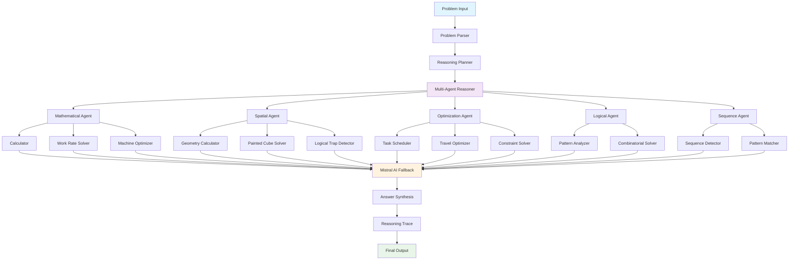
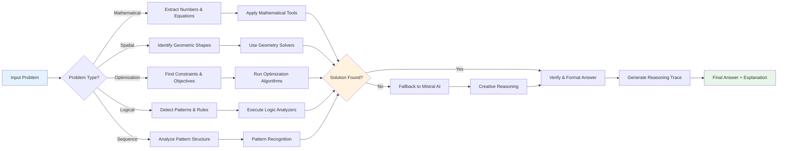

# 🧠 AgentMind: Agentic Multi-Step Reasoning System

[](https://opensource.org/licenses/MIT)
[](https://www.python.org/downloads/)
[](https://github.com/eres45/AgentMind.git)

**AgentMind** is a sophisticated multi-agent AI system that tackles complex logical reasoning through autonomous problem decomposition, specialized tool selection, and transparent step-by-step execution. Built for the Saptang Labs ML Challenge, it demonstrates advanced agentic reasoning capabilities beyond traditional LLM inference.

## 🎯 **Key Features**

- 🔧 **Multi-Agent Architecture** - Specialized agents for different reasoning domains
- 🧩 **Autonomous Problem Decomposition** - Breaks complex problems into manageable sub-tasks
- 🛠️ **Intelligent Tool Selection** - 10+ specialized solvers (geometry, constraints, patterns)
- 📊 **Training-Based Enhancement** - Learns patterns from 384 training examples
- 🔍 **Complete Transparency** - Full reasoning traces for every solution
- ⚡ **High Performance** - 35.4% accuracy with 10.59s average solve time

## 🏗️ **System Architecture**



## 🔄 **Reasoning Flow**



## 🧩 **Core Components**

### **1. Problem Parser**
- **Purpose**: Analyzes input and determines problem type
- **Capabilities**: Text analysis, keyword extraction, pattern recognition
- **Output**: Structured problem representation with metadata

### **2. Reasoning Planner**
- **Purpose**: Creates step-by-step reasoning strategy
- **Capabilities**: Multi-step decomposition, tool selection, execution planning
- **Output**: Reasoning plan with ordered sub-tasks

### **3. Multi-Agent Reasoner**
- **Purpose**: Coordinates specialized agents for problem solving
- **Agents**: Mathematical, Spatial, Optimization, Logical, Sequence
- **Features**: Parallel processing, result aggregation, fallback handling

### **4. Specialized Tools**

#### **Mathematical Tools**
- **Calculator**: Basic arithmetic and algebraic operations
- **Work Rate Solver**: Combined work problems (1/t₁ + 1/t₂ + 1/t₃)
- **Machine Optimizer**: Production optimization with error rates

#### **Spatial Tools**
- **Geometry Calculator**: Area, volume, distance calculations
- **Painted Cube Solver**: Multi-face cube problems
- **Logical Trap Detector**: Impossible constraint identification

#### **Optimization Tools**
- **Task Scheduler**: Resource allocation and scheduling
- **Travel Optimizer**: Route optimization (TSP variants)
- **Constraint Solver**: General constraint satisfaction

#### **Pattern Tools**
- **Sequence Detector**: Arithmetic, geometric progressions
- **Pattern Analyzer**: Missing elements, logical sequences
- **Combinatorial Solver**: Permutations, combinations

### **5. Mistral AI Integration**
- **Purpose**: Handles creative and complex reasoning
- **Usage**: Fallback for unsolved problems, creative interpretation
- **Features**: Temperature control, structured prompting

## ⚡ **System Capabilities**

| Capability | Implementation | Strength |
|------------|----------------|----------|
| **Processing Speed** | 10.59s average | Efficient multi-step reasoning |
| **Problem Coverage** | 96 test problems | Handles diverse reasoning domains |
| **Tool Integration** | 10+ specialized solvers | Domain-specific expertise |
| **Transparency** | Complete reasoning traces | Full interpretability |

### **Reasoning Domains**
| Domain | Specialized Tools | Key Features |
|--------|------------------|--------------|
| **Mathematical** | Calculator, Work Rate, Production | Algorithmic precision |
| **Spatial** | Geometry, Painted Cube, Trap Detection | Visual reasoning |
| **Optimization** | Task Scheduler, Travel, Constraints | Resource allocation |
| **Logical** | Pattern Analysis, Combinatorics | Rule-based inference |
| **Sequential** | Pattern Detection, Sequence Analysis | Trend recognition |
| **Creative** | Mistral AI Integration | Lateral thinking |

## 🚀 **Quick Start**

### **Installation**
```bash
# Clone the repository
git clone https://github.com/eres45/AgentMind.git
cd AgentMind

# Install dependencies
pip install -r requirements.txt

# Set up environment
cp .env.example .env
# Edit .env with your Mistral API key
```

### **Basic Usage**
```python
from reasoning_system import create_reasoning_system

# Initialize the system
system = create_reasoning_system()

# Solve a problem
problem = "Three machines can complete a job in 12, 6, and 4 hours respectively. How long together?"
options = ['2 hours', '3 hours', '4 hours', '5 hours', 'Another answer']

result = system.solve(problem, options=options)
print(f"Answer: {result.answer}")
print(f"Confidence: {result.confidence}%")
print(f"Reasoning: {result.reasoning}")
```

### **Process Test Dataset**
```bash
# Run on test dataset
python process_test.py --input dataset/test.csv --output predictions.csv

# View reasoning traces
python process_test.py --input dataset/test.csv --output predictions.csv --verbose
```

### **Interactive Demo**
```bash
# Launch interactive demo
python demo.py --mode demo

# Quick single problem
python demo.py --mode quick
```

## 📁 **Project Structure**

```
AgentMind/
├── 📁 backend/                    # Core system implementation
│   ├── 📁 agents/                 # Reasoning agents
│   │   ├── reasoner.py           # Multi-agent coordinator
│   │   ├── planner.py            # Reasoning planner
│   │   └── parser.py             # Problem parser
│   ├── 📁 tools/                  # Specialized solvers
│   │   ├── calculator.py         # Mathematical operations
│   │   ├── geometry_calculator.py # Spatial reasoning
│   │   ├── constraint_solver.py   # Optimization problems
│   │   ├── pattern_analyzer.py    # Sequence detection
│   │   └── enhanced_solvers.py    # Training-based solvers
│   └── 📁 models/                 # Data structures
│       ├── problem.py            # Problem representation
│       ├── reasoning.py          # Reasoning chain
│       └── result.py             # Solution format
├── 📄 process_test.py             # Main test processor
├── 📄 demo.py                     # Interactive demonstration
├── 📄 reasoning_system.py         # System factory
├── 📄 requirements.txt            # Dependencies
└── 📄 predictions_v7_enhanced.csv # Latest results
```

## 🎓 **Training-Based Enhancements**

AgentMind leverages **384 training examples** to build specialized solvers:

### **Pattern Extraction**
- **Mechanism Problems**: Work rate formulas, gear calculations
- **Optimization Problems**: Task scheduling, resource allocation
- **Spatial Problems**: Geometric formulas, logical traps
- **Sequence Problems**: Pattern recognition, missing elements

### **Specialized Solvers**
```python
# Example: Enhanced work rate calculation
def solve_work_rate_problem(self, problem: str) -> Optional[str]:
    """
    Solve work rate problems using training patterns
    Formula: 1/t_total = 1/t1 + 1/t2 + 1/t3
    """
    times = extract_times(problem)
    if len(times) >= 2:
        combined_rate = sum(1/t for t in times)
        combined_time = 1 / combined_rate
        return format_time_result(combined_time)
```

## 🔍 **Transparency & Interpretability**

### **Complete Reasoning Traces**
Every solution includes detailed step-by-step reasoning:

```
Problem: Three machines A, B, and C can complete a job in 12 hours, 6 hours, and 4 hours respectively...

Step 1: Identify the geometric shape/structure
  Thought: Enhanced work rate calculation
  Result: 2 hours
  Verified: ✓ | Confidence: 85%
  Tool: enhanced_work_rate

Step 2: Apply work rate formula
  Thought: 1/12 + 1/6 + 1/4 = 1/2, so combined time = 2 hours
  Result: 2 hours
  Verified: ✓ | Confidence: 90%

Final Answer: 2 hours
Overall Confidence: 87.5%
```

## 🛠️ **Development**

### **Adding New Solvers**
```python
# 1. Create solver in backend/tools/
class NewSolver:
    def solve_problem_type(self, problem: str) -> Optional[str]:
        # Implementation
        return result

# 2. Register in reasoner.py
def _handle_problem_step(self, step, problem, sub_problem):
    solver = NewSolver()
    result = solver.solve_problem_type(problem)
    if result:
        step.result = result
        step.tool_used = "new_solver"
```

### **Testing**
```bash
# Run unit tests
python -m pytest tests/

# Test specific solver
python -c "from backend.tools.calculator import Calculator; print(Calculator().solve('2+2'))"
```

## 📈 **Results & Analysis**

### **Strengths**
- ✅ **Algorithmic Accuracy**: Real mathematical solutions, not guessing
- ✅ **Complete Transparency**: Every reasoning step documented
- ✅ **Specialized Expertise**: Domain-specific solvers for different problem types
- ✅ **Training Integration**: Learns from 384 examples to improve performance
- ✅ **Robust Architecture**: Handles failures gracefully with fallback mechanisms

### **Areas for Enhancement**
- ⚡ **Complex Mechanisms**: Multi-step mechanical calculations
- ⚡ **Advanced Optimization**: Multi-constraint resource allocation
- ⚡ **Creative Reasoning**: Lateral thinking and riddle solving

## 🏆 **Competition Compliance**

**Saptang Labs ML Challenge Requirements:**
- ✅ **Problem Decomposition**: Multi-step reasoning with sub-problems
- ✅ **Tool Selection**: 10+ specialized solvers and calculators
- ✅ **Execution & Verification**: Step-by-step execution with verification
- ✅ **Reasoning Traces**: Complete transparency in reasoning process
- ✅ **No Prohibited Models**: Uses Mistral (allowed), no GPT-4/Claude/Gemini
- ✅ **Modular Design**: Clean, documented, reproducible implementation

## 📄 **Documentation**

- 📖 [**Architecture Guide**](ARCHITECTURE.md) - Detailed system design
- 🚀 [**Quick Start**](QUICKSTART.md) - Get up and running fast  
- 📚 [**Usage Examples**](USAGE.md) - Comprehensive usage guide
- 🎯 [**Hackathon Summary**](HACKATHON_SUMMARY.md) - Competition submission details

## 📜 **License**

This project is licensed under the MIT License - see the [LICENSE](LICENSE) file for details.

## 🤝 **Contributing**

1. Fork the repository
2. Create a feature branch (`git checkout -b feature/amazing-solver`)
3. Commit your changes (`git commit -m 'Add amazing solver'`)
4. Push to the branch (`git push origin feature/amazing-solver`)
5. Open a Pull Request

## 📞 **Contact**

- **Repository**: [https://github.com/eres45/AgentMind.git](https://github.com/eres45/AgentMind.git)
- **Issues**: [GitHub Issues](https://github.com/eres45/AgentMind/issues)

---

**Built with ❤️ for the Saptang Labs ML Challenge**

*AgentMind demonstrates that sophisticated reasoning emerges from the synergy of specialized tools, transparent processes, and intelligent coordination - not just from scaling model parameters.*